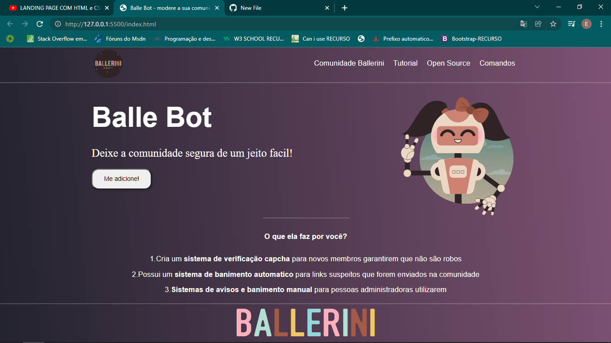

# BalleBot

- Esse projeto foi criado pela @Rafaella Ballerine, com o intuito de ajudar programadores novos a se densenvolver
### Tomei a liberdade de alterar algumas coisa para deixar o projeto mais com minha cara
- Alterei as cores principais da landing page
- inclui todo o projeto em um container definido em % dessa forma o conteudo ficou responsivo
- Adicionei um menu hamburguer para não atrapalhar a responsividade

### Tecnologias Utilizadas:
- HTML
- CSS
- Javascript

